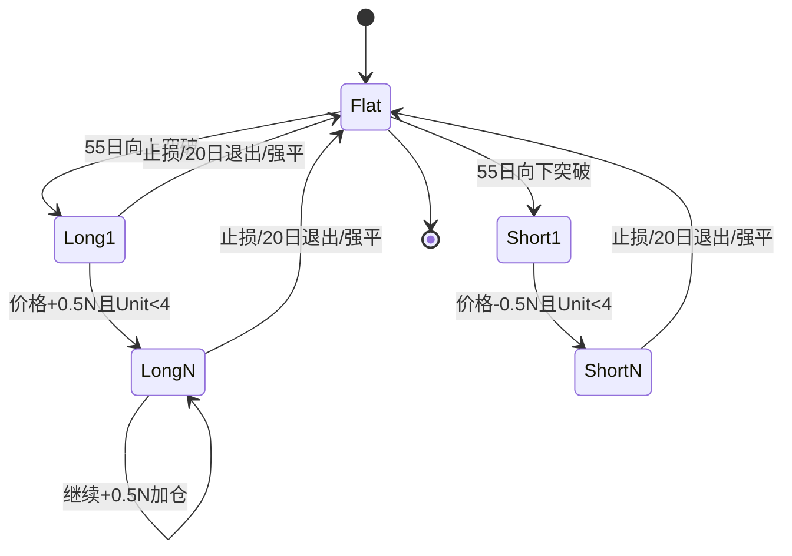

# 0015_T1海龟交易系统完整项目设计

> 版本：v1.0.0  
> 创建日期：2026-05-17  
> 状态：📋 待审核  
> 工作区：项目区（stock-quant）

---

## 文档说明

本文档在以下材料基础上，对 **T1 基金海龟交易系统** 做完整项目级设计，作为后续编码、回测与实盘对接的单一事实来源（SSOT）。

| 来源 | 路径 | 内容性质 |
|------|------|----------|
| 交易系统规则（Word） | `notebooks/turtle-strategy/交易系统(2)，19.9.28.docx` | T1 策略规则 V1.0（入市/加仓/止损/退出/品种） |
| 基金风控方案（Word） | `notebooks/turtle-strategy/T1基金风控方案191122.docx` | 名义资金、I.V、清盘线、风险度、交割月 |
| 头寸计算器（Excel） | `notebooks/turtle-strategy/海龟交易法则头寸规模计算器.xlsx` | Unit 公式、组合持仓上限 |
| 交易系统台账（Excel） | `notebooks/turtle-strategy/交易系统(1)2019.10.11.xlsx` | 品种参数表、规则摘要、合约规格、历史成交 |
| 策略描述（已整理） | `notebooks/research/0013_T1海龟交易系统描述.md` | 业务规则文字版 |
| 技术模块设计（已整理） | `notebooks/research/0014_T1海龟交易系统设计.md` | 六层架构与接口草案 |
| 经典海龟调研 | `notebooks/research/0005_海龟交易策略深度调研.md` | 原版/改良版对比、A 股适配 |
| 回测平台设计 | `notebooks/research/0011_回测系统详细设计.md` | Backtrader 回测集成 |
| 实盘对接设计 | `notebooks/research/0012_VN.py实盘对接详细设计.md` | VN.py 网关（可选） |

**关联文档**：0013（描述）· 0014（技术模块）· 0011（回测）· 0012（VN.py）

---

## 一、项目目标与范围

### 1.1 项目目标

在 stock-quant 项目中实现一套 **可回测、可扩展至实盘** 的 T1 海龟趋势跟踪系统，满足：

1. **规则忠实**：与 T1 原始文档（2019）在参数与执行逻辑上可追溯、可审计  
2. **风险分层**：策略层（单笔 2N）+ 组合层（Unit 上限）+ 基金层（净值/I.V/清盘线）  
3. **工程复用**：接入既有 `backtest/` 框架与 `strategies/turtle.py` 占位，避免重复造轮子  
4. **配置驱动**：品种合约乘数、保证金、关联组、交割规则等来自配置表，非硬编码

### 1.2 范围边界

| 在范围内 | 不在范围内（本期） |
|----------|-------------------|
| 中国大宗商品期货（T1 品种池） | A 股纯多头改良版（见 0005，另立策略） |
| 日线信号 + 日内突破触发逻辑建模 | 文华财经条件单直连（仅作实盘参考） |
| 回测 + 纸面/模拟盘 | 生产级 7×24 运维与多账户 |
| 基金级风控规则编码 | T1 基金法律主体与分账清算 |

### 1.3 成功标准

- 回测可复现 2019 年台账中至少 3 个品种的开平仓与止损价逻辑（允许滑点差异）  
- 单笔风险、4 Unit 上限、20 日退出、55 日突破与文档一致  
- 基金风控触发（70% 清盘、90% 风险度砍仓）有单元测试覆盖  
- 输出标准绩效报告（年化、最大回撤、夏普、卡玛、胜率）

---

## 二、策略原理与版本对照

### 2.1 策略本质

T1 系统是 **Richard Dennis 海龟法则** 在国内商品期货上的落地版本：

- **趋势跟踪**：突破近期区间高点/低点顺势建仓  
- **波动率定仓**：用 20 日 EMA 的 TR（N/ATR）统一各品种风险敞口  
- **金字塔加仓**：趋势延续时按固定 N 间隔加码，截断亏损、让利润奔跑  
- **多层风控**：交易规则止损 + 账户风险度 + 基金净值管理

### 2.2 经典海龟 vs T1 实施（决策表）

| 维度 | 经典海龟（0005） | T1 实施（本项目 SSOT） | 设计决策 |
|------|------------------|------------------------|----------|
| 入市周期 | 20 日（改良）/ 55 日（原版系统一） | **55 日** 突破 | 采用 T1 文档，偏长周期、低假突破 |
| 出场周期 | 10～20 日 | **20 日** 反向突破 | 与 T1 一致 |
| ATR 周期 | 14～20 日 | **20 日 EMA** | `N=(19×PDN+TR)/20` |
| 单笔风险 | 账户 1%～2% | **1% 定仓**，**2% 止损上限** | 定仓用 1%；止损距离 2N 对应约 2% 风险 |
| 加仓间隔 | 0.5 ATR | **0.5N**（从上一单位成交价） | 与 docx / 0013 一致 |
| 单品种 Unit | 最多 4 | **最多 4** | 一致 |
| 组合 Unit 上限 | 4/6/10～12（计算器） | **单品种 4；同向 ≤12；关联 ≤10** | 以 Excel Sheet2 + 计算器为准 |
| 触发时机 | 收盘或次日 | **日内突破即成交** | 回测需分钟线或「突破价触达」模拟 |
| 市场 | 多市场 | **国内商品期货** | 品种池见 §4.4 |

---

## 三、完整交易算法规格

### 3.1 符号定义

| 符号 | 含义 |
|------|------|
| H, L, C | 当日最高、最低、收盘 |
| PDC | 前交易日收盘价 |
| TR | `MAX(H-L, \|H-PDC\|, \|L-PDC\|)` |
| N | TR 的 20 日指数移动平均（ATR） |
| PDN | 前一日的 N |
| PV | 每点人民币价值（= 合约乘数 × 最小变动计价，见配置表） |
| E | 名义总资金（非净值，见 §5.2） |

### 3.2 N 值（波动性）计算

```
TR = MAX(H - L, |H - PDC|, |L - PDC|)
N[0] = SMA(TR, 20)                    # 冷启动
N[t] = (19 × N[t-1] + TR[t]) / 20      # t ≥ 1
```

**实现注意**：与 Wilder 平滑 ATR 等价；回测与实盘需统一，避免与「简单 20 日均 TR」混用。

### 3.3 头寸单位（Unit）计算

```
风险金额 = E × 1%
每手 1N 风险 = N × PV
Unit手数 = 风险金额 / (N × PV)
实际开仓手数 = floor(Unit手数)          # 向下取整；为 0 时不得开仓
```

**计算器校验**（`海龟交易法则头寸规模计算器.xlsx`）：

- 资金 100 万、风险 1%、ATR=50、PV=300 元/点 → Unit≈0.67 手 → 实际 0 或 1 手  
- 若强开 1 手，实际风险约 1.5%，需在风控层告警

### 3.4 入市（Entry）

**条件**：

1. 价格 **突破前 55 个交易日** 的最高价（做多）或最低价（做空）  
2. 当前品种无持仓，或处于允许加仓状态（见 §3.5）  
3. 未处于：交割月禁入、基金静默期、风险度禁开仓、品种黑名单

**执行**：

- **日内突破**：价格触达突破位即建仓，**不等待收盘**  
- **跳空**：开盘价已超过突破位 → **开盘即建仓**  
- 首次仅建 **1 个 Unit**

**信号伪代码**：

```
breakout_high = MAX(high[-55:])
breakout_low  = MIN(low[-55:])

if price >= breakout_high and direction_allowed(LONG):
    signal = ENTER_LONG
elif price <= breakout_low and direction_allowed(SHORT):
    signal = ENTER_SHORT
```

### 3.5 加仓（Add）

**条件**（同时满足）：

1. 已有持仓，未触发止损/退出  
2. 当前 Unit 数 < 4  
3. 价格相对 **上一 Unit 成交价** 有利方向移动 ≥ **0.5N**  
4. 组合层 Unit 上限未超限（§3.8）

**执行**：

- 理想成交价 = `last_entry ± 0.5N`（多/空）  
- 若跳空无法在设定点位成交 → **开盘价或市价** 加仓  
- 每成功加仓 1 Unit，执行 §3.6 止损上移

**与 Excel 备注对齐**：Sheet2 写「0.5N, 1N, 1.5N」指相对首单的 **累计间隔**，与「每加 0.5N」等价，不采用 1N 步长加仓。

### 3.6 止损（Stop Loss）

**原则**：

- 单笔交易风险 **不得超过账户 2%**  
- 止损距离：**2N**（相对首单或统一止损价，见下）  
- 每增加 1 Unit，**前面所有 Unit 止损上移 0.5N**（多头为上移，空头为下移）

**多头止损价演化**（N=1.20，原油示例，与 docx 一致）：

| 阶段 | 单位数 | 入市价序列 | 统一止损 |
|------|--------|------------|----------|
| 首单 | 1 | 28.30 | 25.90 (=28.30-2N) |
| 加2 | 2 | 28.90 | 26.50 |
| 加3 | 3 | 29.50 | 27.10 |
| 加4 | 4 | 30.10 | 27.70 |
| 跳空加4 | 4 | 末单 30.80 | 前 3 单维持 27.70；**第 4 单止损 28.40**，且 **前序止损不再动态调整** |

**规则摘要**：

```
base_stop = entry_first - 2N * direction
stop_all  = base_stop + direction * (units_filled - 1) * 0.5 * N

# 跳空例外：若新 Unit 成交价偏离预期 ≥ 阈值（如 >0.5N），
# 则 skip_adjustment=True，仅更新新 Unit 止损
```

**触发**：日内价格触达止损 → 平掉该品种 **全部 Unit**。

### 3.7 离市（Exit）

**20 日反向突破**（与止损并行，满足即平全部）：

- 多头：`close < MIN(low[-20:])` 或日内最低价下穿  
- 空头：`close > MAX(high[-20:])` 或日内最高价上穿  

**优先级**（同日多信号）：

1. 强制清盘 / 基金静默强制减亏  
2. 止损触发  
3. 20 日反向突破  
4. 交割月强制平仓（14:30 前）

### 3.8 组合仓位约束（来自 Excel + 计算器）

| 约束 | 上限 | 说明 |
|------|------|------|
| 单一品种 | 4 Unit | 同方向多次加仓累计 |
| 高度相关市场合计 | 6 Unit | 见 §4.4 关联组 |
| 单一方向（多或空）全市场 | **10～12 Unit** | 配置默认 12，可保守取 10 |
| 关联品种合计 | **≤10 Unit** | Sheet2 规则 |

**强关联品种组**（T1）：

- 黄金 ↔ 白银  
- 铁矿 ↔ 螺纹（热卷可扩展入组，待季度复核）  
- 豆粕 ↔ 豆油 ↔ 菜粕 ↔ 郑油  

### 3.9 品种筛选与排序

1. 按 **保证金占用资金量** 排序，优先流动性高的品种  
2. **不交易**（Sheet2）：粳米、20 号胶、棉纱、纤板、菜籽、郑麦、晚稻、线材、胶板、普麦、早稻、粳稻等  
3. **每季度更新** 品种池与关联组（配置 `config/instruments.yaml`）

### 3.10 完整状态机



---

## 四、基金级与账户级风控

### 4.1 资金架构（历史设定，回测可参数化）

| 参数 | 值 |
|------|-----|
| 基金总规模 | 200 万（两人各 50%） |
| 第一期入市 | 2019-11-18，100 万 |
| 名义总资金（阶段） | 2019-11-18～11-30：50 万；2019-12-01 起可调至 100 万 |

回测时 `nominal_capital` 与 `initial_equity` 分离建模（见 §5.2）。

### 4.2 内在价值（I.V）

```
对每个多头持仓:
  mark_price = max(当前止损价, 近20日最低价)
  position_value = mark_price × 手数 × PV

I.V = 现金 + Σ position_value
```

**用途**：月末若 `I.V > 当月名义总资金` → 下月起上调名义总资金至 `I.V`。

### 4.3 名义总资金下调与静默期

| 触发条件（月末收盘） | 动作 |
|----------------------|------|
| 净值 < 初始投资 90% | 名义资金 = 初始 × 0.8 |
| 净值 < 初始投资 80% | **静默期 1 个月**（禁止新开仓，允许平仓）；名义资金 = 初始 × 0.64 |
| 任意日收盘净值 < 初始 70% | **次日强制清盘**，全部平仓 |

### 4.4 风险度与砍仓

```
风险度 = 持仓占用保证金 / 账户权益
```

| 条件 | 动作 |
|------|------|
| 风险度 > 90% | 停止开仓；暂停条件单；**砍仓**至 <90% |
| 砍仓优先级 | 亏损金额最高的合约优先 |
| T 日砍仓后风险度 < 80% | T+1 可恢复开仓 |

交易所上调保证金导致风险度 >90% 时，按保证金上调比例 **等比例减仓**。

### 4.5 交割月规则

- 任何头寸 **不得进入交割月**  
- 最晚在交割月前最后一个交易日 **14:30** 前全部平仓  
- 数据层：交割月前第 N 日标记 `delivery_exclude=True`（0014 建议前 5 个交易日）

---

## 五、系统架构设计

### 5.1 逻辑分层

```
┌────────────────────────────────────────────────────────────┐
│ 配置层  instruments.yaml / fund_rules.yaml / strategy.yaml │
└────────────────────────────┬───────────────────────────────┘
                             ▼
┌────────────────────────────────────────────────────────────┐
│ 数据层  market | portfolio | account | calendar            │
└────────────────────────────┬───────────────────────────────┘
                             ▼
┌────────────────────────────────────────────────────────────┐
│ 因子层  atr(N) | breakout_55 | exit_20 | gap_flag          │
└────────────────────────────┬───────────────────────────────┘
                             ▼
┌────────────────────────────────────────────────────────────┐
│ 策略层  TurtleStrategy (信号 + 状态机)                      │
└────────────────────────────┬───────────────────────────────┘
                             ▼
┌────────────────────────────────────────────────────────────┐
│ 仓位层  UnitSizer | PositionBook | StopManager             │
└────────────────────────────┬───────────────────────────────┘
                             ▼
┌────────────────────────────────────────────────────────────┐
│ 风控层  TradeRisk | PortfolioRisk | FundRisk | Delivery    │
└────────────────────────────┬───────────────────────────────┘
                             ▼
┌────────────────────────────────────────────────────────────┐
│ 执行层  SimBroker | VNpyAdapter (可选)                     │
└────────────────────────────┬───────────────────────────────┘
                             ▼
┌────────────────────────────────────────────────────────────┐
│ 分析层  BacktestEngine | Performance | Report              │
└────────────────────────────────────────────────────────────┘
```

与 `0014` 六层架构对齐，并显式增加 **配置层** 与 **基金风控层**。

### 5.2 核心领域模型

```python
@dataclass
class InstrumentConfig:
    symbol: str
    contract_size: int      # 每手乘数
    price_tick: float
    point_value: float      # 每点人民币
    margin_ratio: float
    correlated_group: str | None

@dataclass
class TurtlePosition:
    symbol: str
    direction: int          # 1 / -1
    units: int            # 1..4
    entries: list[float]  # 各 Unit 成交价
    stop_loss: float
    n_at_entry: float
    skip_stop_adjust: bool  # 跳空例外

@dataclass
class FundState:
    initial_equity: float
    nominal_capital: float   # 用于 Unit 计算的资金口径
    intrinsic_value: float
    nav_ratio: float
    silent_until: date | None
    risk_exposure: float
```

### 5.3 目录结构（目标）

```
stock-quant/
├── config/
│   ├── instruments.yaml       # Sheet3 合约规格 + 品种池
│   ├── correlated_groups.yaml
│   └── fund_rules.yaml          # 70%/80%/90% 等
├── strategies/
│   └── turtle/
│       ├── __init__.py
│       ├── factors.py           # N, 55突破, 20退出
│       ├── position.py          # Unit/止损/加仓
│       ├── risk.py              # 三层风控
│       └── strategy.py          # Backtrader / 自研适配
├── backtest/                    # 已有，0011
├── data/                        # SQLite，不入库
├── notebooks/
│   ├── turtle-strategy/         # 原始资料（只读归档）
│   └── research/              # 0013～0015 设计文档
├── tests/
│   └── turtle/
│       ├── test_atr.py
│       ├── test_unit_size.py
│       ├── test_stop_ladder.py
│       └── test_fund_risk.py
└── scripts/
    └── run_turtle_backtest.py
```

### 5.4 与现有模块集成

| 模块 | 集成方式 |
|------|----------|
| `0011` 回测系统 | `strategies/turtle.py` 实现 `StrategyBase`，由 `run_backtest.py` 驱动 |
| `0014` 技术草案 | 本设计吸收并修正命名空间（`turtle/` 子包） |
| `0012` VN.py | Phase 5 通过 `VNpyBrokerAdapter` 对接，信号层不变 |
| `0005` 经典海龟 | 作为参数对照测试集（20/10 版本可 `strategy.yaml` 切换） |

---

## 六、数据与配置设计

### 6.1 行情数据需求

| 粒度 | 用途 | 优先级 |
|------|------|--------|
| 日线 OHLC | N、55/20 突破计算 | P0 |
| 分钟线 / Tick | 日内突破、止损触达 | P1（无则退化：日线 high/low 触达） |

**数据源**：akshare 期货主力连续（回测需处理换月与跳空）。

### 6.2 配置表（来自 `交易系统(1)2019.10.11.xlsx`）

**Sheet3** 提供 40+ 品种的：交易单位、报价单位、变动价位、保证金比例 —— 导入 `instruments.yaml`。

**Sheet1** 提供实操示例字段：

- `头寸/次` = `1% × 资金 / (N × 每手)`  
- `加仓N/2` = 0.5N 间隔  
- `止损2N` = 2N 止损距离  
- `入场点` / `加仓点1~3` = 55 日突破价 + 0.5N 阶梯  

**Sheet4** 历史成交用于 **回归测试黄金样本**（如 AG1912 多次加仓、IF 股指止损序列）。

### 6.3 待确认项（实现前需你确认）

1. **Sheet2 关联组** 标注「待确认，每季度更新」— 是否以 2019 版为初始，热卷并入螺纹组？  
2. **股指/国债** 在 Sheet4 出现但 T1 docx 品种表未列 — 是否纳入回测品种池？  
3. **日内突破回测**：无分钟线时，是否接受「当日 high/low 触达即成交」的乐观偏差说明？  
4. **名义资金与净值**：回测默认 `nominal_capital = initial_equity`，还是模拟 50 万阶段？

---

## 七、关键流程（时序）

### 7.1 交易日盘中循环

```
for each bar (intraday or daily):
  1. 更新 N（仅日切换时重算）
  2. 检查 FundRisk：清盘/静默/风险度 → 可能禁止开仓或强平
  3. 检查 DeliveryRisk → 可能强制平仓
  4. 对有持仓品种：
     a. 更新浮动盈亏
     b. 检查止损、20日退出
     c. 检查加仓（+0.5N）
  5. 对无持仓品种：
     a. 检查 55 日突破 → 建 Unit 1
  6. 更新 I.V、风险度（日终）
```

### 7.2 月末流程

```
if last_trading_day_of_month:
  compute I.V, NAV
  adjust nominal_capital per §4.2～4.3
  if NAV < 0.8: set silent_until = +1 month
```

---

## 八、测试与验收

### 8.1 单元测试（必须）

| 用例 | 验证点 |
|------|--------|
| `test_atr_ema` | N 递推与文华 ATR(20) 抽样一致 |
| `test_unit_floor` | 计算器示例：0.67 手 → 0 手不开仓 |
| `test_stop_ladder` | 原油 4 单位止损 27.70 |
| `test_gap_add` | 跳空第 4 单位止损 28.40、前序不调整 |
| `test_exit_20` | 20 日最低下穿平多 |
| `test_fund_liquidate` | NAV<70% 次日全平 |
| `test_risk_90` | 风险度>90% 砍仓至<90% |

### 8.2 回归测试

- 输入：Sheet4 部分成交记录（AG、RB、原油等）  
- 输出：开仓/加仓/止损价与台账误差 < 1 tick  

### 8.3 回测验收指标（建议基线）

| 指标 | 说明 |
|------|------|
| 年化收益 / 最大回撤 / 夏普 / 卡玛 | 0011 标准输出 |
| 平均持仓 Unit 数 | 应 ≤4/品种 |
| 止损触发占比 | 趋势策略常见 40～60% |
| 静默期触发次数 | 基金风控有效性 |

---

## 九、实施计划

| Phase | 内容 | 产出 | 依赖 |
|-------|------|------|------|
| **P0** | 配置导入：Sheet3→yaml；品种池/关联组 | `config/*.yaml` | 本文档审核通过 |
| **P1** | 因子层：N、55 突破、20 退出 + 单元测试 | `factors.py` + tests | P0 |
| **P2** | 仓位层：Unit 计算、加仓、止损阶梯 | `position.py` + tests | P1 |
| **P3** | 策略 + 回测接入 Backtrader | `strategies/turtle/` | P2, 0011 |
| **P4** | 基金/账户风控 + 交割月 | `risk.py` + tests | P3 |
| **P5** | 全品种回测 + 绩效报告 | `output/turtle/` | P4 |
| **P6**（可选） | VN.py 模拟/实盘 | 0012 适配器 | P5 |

**0014 原 Phase 1～5** 映射：P0～P5 与之等价，并增加配置导入与回归测试。

---

## 十、风险与限制

1. **历史规则冻结**：基于 2019 年 T1 文档，保证金与品种池已变化，实盘前必须重导配置  
2. **日内成交近似**：缺 Tick 时回测结果可能偏乐观/悲观，需在报告中披露  
3. **换月与连续合约**：主力拼接引入虚假突破，需 roll 规则或指数连续合约  
4. **关联组主观性**：组合 6/10 Unit 上限依赖人工分组，影响分散化效果  
5. **静默期与清盘**：极端行情下可能连续触发，需 Monte Carlo 压力测试

---

## 十一、文档与知识库

| 文档 | 角色 |
|------|------|
| **0015（本文）** | 项目 SSOT：算法 + 架构 + 计划 |
| 0013 | 业务描述（面向阅读） |
| 0014 | 技术模块接口（面向开发） |
| 0005 | 经典海龟对照与 A 股扩展参考 |
| turtle-strategy/ | 原始凭证，不再修改 |

审核通过后建议：

1. 更新 `0001_项目设计.md` 飞书节点表，增加 0015  
2. 同步飞书知识库  
3. 在 `0003_变更日志.md` 记录 v1.0 创建

---

## 十二、审核清单

请确认以下项后回复 **「可以」** 或 **「执行」**，再进入编码阶段（项目区将派生子任务实施）：

- [ ] 55 日入市 / 20 日退出 / 20 日 N / 0.5N 加仓 / 2N 止损 作为 SSOT  
- [ ] 组合上限：单品种 4、关联 10、同向 12 Unit  
- [ ] 基金风控 70%/80%/90% 与 I.V 名义资金规则纳入回测  
- [ ] 目录结构 `strategies/turtle/` 子包方案  
- [ ] §6.3 待确认项的选择  

---

> 原始资料目录：`notebooks/turtle-strategy/`  
> 技术细化：`notebooks/research/0014_T1海龟交易系统设计.md`
